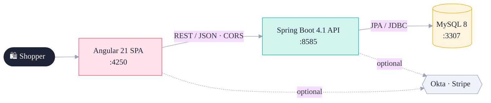

# Luv2Shop — Full-Stack E-Commerce (Angular + Spring Boot)

A modern build of the Udemy *"Full Stack: Angular and Spring Boot E-Commerce"* course
project, on a current stack: **Spring Boot 4.1 / Java 21** and **Angular 21 (standalone)**.

## Stack
- **Backend:** Spring Boot 4.1, Spring Data JPA + REST, Spring Security (OAuth2 resource
  server), MySQL, Stripe (`stripe-java`).
- **Frontend:** Angular 21 standalone, Bootstrap 5, ng-bootstrap, Okta (`@okta/okta-angular`),
  Stripe Elements (`@stripe/stripe-js`).

## Layout
- `backend/` — Spring Boot API (package `com.bob.ecommerceangularapp`).
- `frontend/angular-ecommerce/` — Angular app.
- `docs/` — architecture, API reference, dev guide, Stripe, build plan ([docs index](docs/README.md)).
- `CLAUDE.md` — onboarding guide and conventions.

## Features
- **Catalog** — product grid, keyword search, category filter, server-side pagination,
  product detail, loading + empty states.
- **Cart & checkout** — `sessionStorage` cart with live totals, reactive checkout
  (country/state cascade, copy-shipping-to-billing), order persistence, confirmation page.
- **Security** — Okta OIDC protecting order history. *Gated on config:* the app runs without it.
- **Payments** — Stripe payment intents + card Element. *Gated on config.*
- **HTTPS** — opt-in TLS (documented in `docs/BUILD_PLAN.md`).

Okta and Stripe degrade gracefully — the app builds and runs (catalog → cart → checkout)
with placeholder config, and lights up the moment real keys are supplied.

## Architecture



Full diagrams (backend layers, frontend, ER model, request + checkout flows) live in
**[docs/ARCHITECTURE.md](docs/ARCHITECTURE.md)**.

## Documentation

| Doc | Contents |
|---|---|
| [Architecture](docs/ARCHITECTURE.md) | context, layers, data model, sequence flows (diagrams) |
| [API reference](docs/API.md) | endpoints, examples, pagination envelope |
| [Development guide](docs/DEVELOPMENT.md) | build, run, test, ports, conventions, DoD |
| [Stripe guide](docs/STRIPE.md) | payments setup (beginner-friendly) |
| [Build plan](docs/BUILD_PLAN.md) | milestones M0–M5 + decisions |

## Run locally
Prerequisites: **JDK 21+**, **Node 20+**, and **Docker running**.

One command (from **Git Bash**) — builds both, launches them, and opens the browser:

```bash
./run.sh
```

Then open **http://localhost:4250**. Press **Ctrl+C** in that terminal to stop **both** servers.

Or run the pieces manually:

```bash
# Backend — spring-boot-docker-compose auto-starts MySQL on :3307
cd backend && ./mvnw spring-boot:run            # http://localhost:8585/api/products

# Frontend
cd frontend/angular-ecommerce
npm install && npm start                        # http://localhost:4250
```

Ports are intentionally non-default (**backend 8585, frontend 4250, MySQL 3307**) to avoid
clashing with anything already on 8080 / 4200 / 3306. To create the database by hand instead
of via docker-compose, run `backend/schema.sql` against your MySQL.

### No external accounts needed to explore
The whole app is usable without Okta or Stripe:
- **Login (Okta):** not configured → every page is viewable, and "My orders" shows recent orders in *demo mode*.
- **Payments (Stripe):** not configured → checkout skips the card step and places the order directly in *demo mode*.

To enable real (test-mode) card payments, follow the beginner-friendly **[docs/STRIPE.md](docs/STRIPE.md)**.

## Build & test
```bash
# Backend: compiles, runs tests against in-memory H2 (no Docker needed), packages a jar
cd backend && ./mvnw clean package

# Frontend: production build + unit tests
cd frontend/angular-ecommerce && npx ng build
cd frontend/angular-ecommerce && CI=true npx ng test --watch=false
```

See **`docs/BUILD_PLAN.md`** for the milestone breakdown and the steps to enable Okta,
Stripe, and HTTPS.
