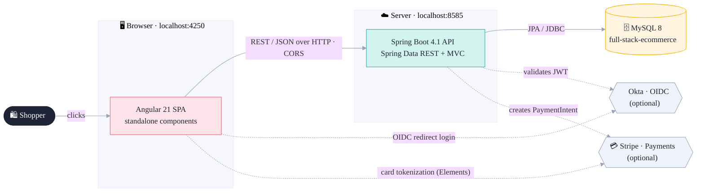
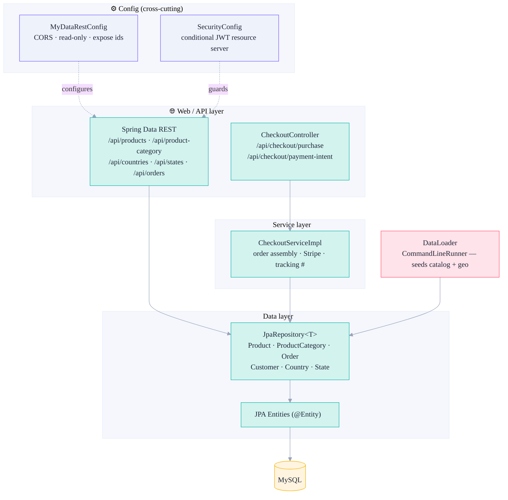
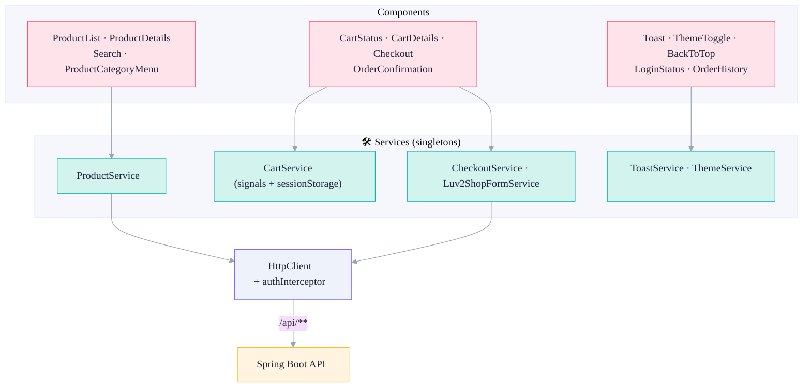
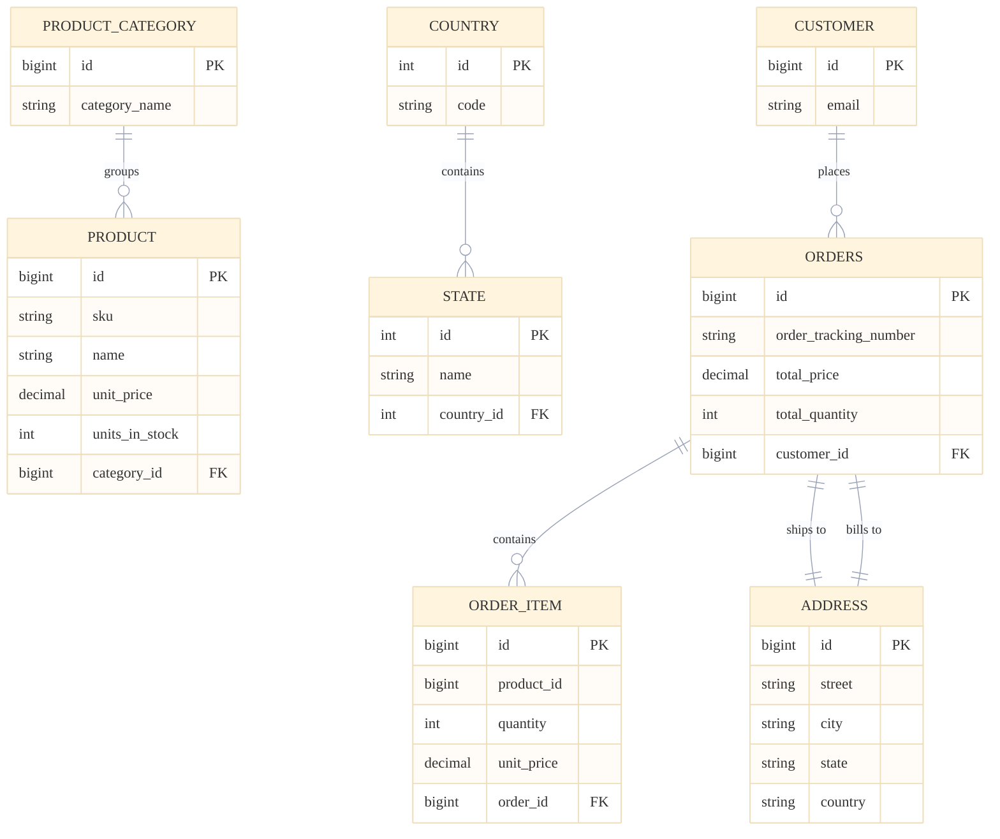
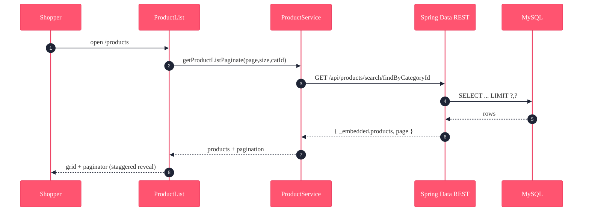
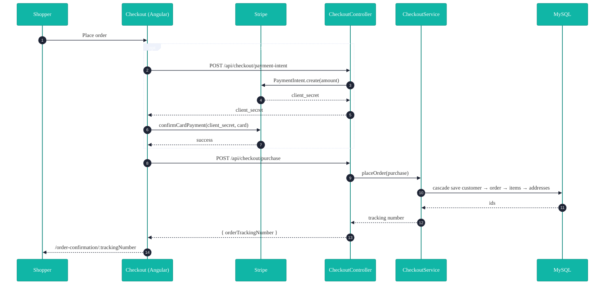

# Luv2Shop — Architecture

A full-stack e-commerce reference app: an **Angular 21** single-page storefront talking to a
**Spring Boot 4.1** REST API backed by **MySQL 8**, with **Okta** (auth) and **Stripe** (payments)
as optional, gracefully-degrading integrations.

- [System context](#1-system-context)
- [Backend architecture](#2-backend-architecture)
- [Frontend architecture](#3-frontend-architecture)
- [Data model](#4-data-model)
- [Key flows](#5-key-flows)
- [Cross-cutting concerns](#6-cross-cutting-concerns)
- [Tech stack](#7-tech-stack)

---

## 1. System context

How the pieces fit together and what crosses each boundary.

> **Graceful degradation:** Okta and Stripe are optional. Without them the app still builds and
> runs — login pages stay viewable (demo mode) and checkout skips the card step and saves the order
> directly. See [STRIPE.md](STRIPE.md) and [BUILD_PLAN.md](BUILD_PLAN.md) §M3.

---

## 2. Backend architecture

A classic layered Spring Boot app. Most read endpoints are **auto-generated** by Spring Data REST
straight from the repositories; only checkout is a hand-written controller.

**Package layout** (`com.bob.ecommerceangularapp`):

| Package | Responsibility |
|---|---|
| `entity` | JPA entities — `Product`, `ProductCategory`, `Order`, `OrderItem`, `Customer`, `Address`, `Country`, `State` |
| `dao` | Spring Data `JpaRepository` interfaces (most auto-exposed as REST) |
| `dto` | `Purchase`, `PurchaseResponse`, `PaymentInfo` |
| `service` | `CheckoutService` / `CheckoutServiceImpl` |
| `controller` | `CheckoutController` |
| `config` | `MyDataRestConfig` (CORS + exposure), `SecurityConfig` (JWT) |
| `bootstrap` | `DataLoader` (seed data) |

---

## 3. Frontend architecture

Standalone Angular components → injectable services → `HttpClient` → REST API. A functional HTTP
interceptor attaches the Okta bearer token to the secured order endpoints.

Routes: `/products`, `/products/:id`, `/category/:id`, `/search/:keyword`, `/cart-details`,
`/checkout`, `/order-confirmation/:trackingNumber`, `/members/orders` (guarded), `/login/callback`,
`**` → 404.

---

## 4. Data model

The exact DDL Hibernate generates is in [`backend/schema.sql`](../backend/schema.sql).

---

## 5. Key flows

### 5a. Browse the catalog

### 5b. Checkout & save order

---

## 6. Cross-cutting concerns

| Concern | How it's handled |
|---|---|
| **CORS** | `MyDataRestConfig` + `@CrossOrigin` allow the Angular origin(s) (`:4200`, `:4250`) |
| **Security** | `SecurityConfig` — JWT resource server, *active only* when an Okta issuer is configured; otherwise an open chain. Protects `GET /api/orders/**`. |
| **Pagination** | Spring Data REST HAL envelope: `_embedded.<rel>` + `page:{number,size,totalElements,totalPages}` |
| **Seeding** | `DataLoader` (`CommandLineRunner`) — idempotent, only seeds an empty DB |
| **State (FE)** | `CartService` uses Angular signals + `sessionStorage`; `ThemeService` persists theme |
| **Notifications** | `ToastService` (signal-driven) + `<app-toast>` hub |
| **Config** | MySQL via docker-compose; secrets (Stripe/Okta) via env vars, never committed |

---

## 7. Tech stack

| Layer | Technology |
|---|---|
| Frontend | Angular 21 (standalone), TypeScript, Bootstrap 5, ng-bootstrap, Font Awesome, Stripe.js, Okta Angular |
| Backend | Spring Boot 4.1, Spring Data JPA + REST, Spring Security (OAuth2 resource server), Spring MVC, Lombok, stripe-java |
| Data | MySQL 8 (prod/dev), H2 (tests) |
| Build / tooling | Maven (wrapper), Angular CLI, Vitest, JUnit 5, Docker Compose |

See also: **[API.md](API.md)** · **[DEVELOPMENT.md](DEVELOPMENT.md)** · **[STRIPE.md](STRIPE.md)** · **[BUILD_PLAN.md](BUILD_PLAN.md)**
