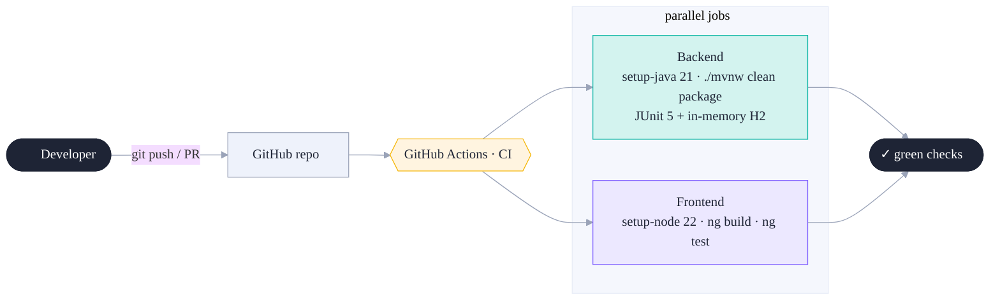
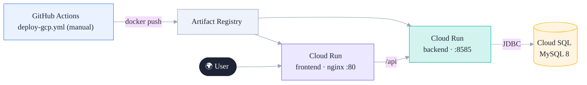
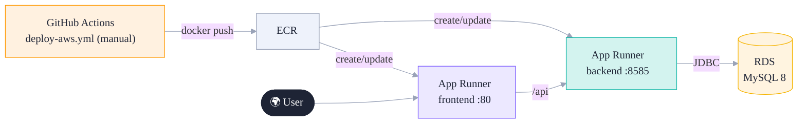
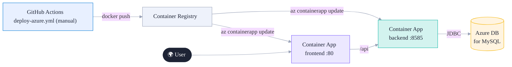

# Luv2Shop — CI/CD & Deployment

> **Local development stays primary.** `./run.sh` is how you build and run day to day.
> Everything below is **opt-in**: the full-stack container deploy is one command, CI runs build+test
> on push, and the cloud deploys are **manual templates** (`workflow_dispatch`) you fill in with your
> own project IDs, registries, and secrets. Nothing here changes your local dev workflow.

The path this guide walks: **run it locally in containers → prove it works → push the same images to a
cloud.** A cloud deploy is the local container deploy with the registry and database swapped for managed
services.

- [Deploy locally (full stack in containers)](#deploy-locally-full-stack-in-containers) — start here
- [Continuous Integration](#continuous-integration)
- [Container images](#container-images)
- [From local to the cloud](#from-local-to-the-cloud)
- [Cloud deployments](#cloud-deployments) — [GCP](#google-cloud-cloud-run) · [AWS](#aws-app-runner) · [Azure](#azure-container-apps)
- [Walkthrough: GCP Cloud Run, end to end](#walkthrough-gcp-cloud-run-end-to-end)
- [What you configure](#what-you-configure)

---

## Deploy locally (full stack in containers)

The repo-root [`compose.yaml`](../compose.yaml) builds and runs **all three tiers** — the Angular SPA
(nginx), the Spring Boot API, and MySQL 8 — as containers, using the very same images the cloud runs.
This is the production-shaped deploy you can run on your laptop.

```bash
# from the repo root
docker compose up --build          # add -d to run detached
```

Then open **http://localhost:4250**. The API is on **http://localhost:8585**, MySQL on **3307**.

What happens on first boot, with no manual DB setup:
1. MySQL starts; Compose waits for its healthcheck before starting the backend.
2. The backend boots under the **`prod` profile** and **Flyway migrates the empty database**
   (`V1` baseline → `V2` indexes); `ddl-auto=validate` then confirms the entities match.
3. The `DataLoader` seeds the catalog, so the store is populated the moment the page loads.

```bash
docker compose ps                         # see container/health status
docker compose logs -f backend            # follow backend logs (ECS JSON in prod profile)
curl http://localhost:8585/actuator/health/readiness   # -> {"status":"UP"}
docker compose down                       # stop; add -v to also drop the MySQL volume
```

Optional integrations (Stripe, Okta, email) are off by default and degrade gracefully — uncomment the
env vars in `compose.yaml` to enable them. This is also the fastest way to **smoke-test a release
candidate** the way it will run in the cloud.

---

## Continuous Integration

`.github/workflows/ci.yml` runs on every push / PR — pure verification, no deploys.



The backend job needs **no database** — tests run against in-memory H2. The frontend job runs
Vitest in jsdom (no browser needed).

---

## Container images

Both apps ship as containers (used by every cloud target):

| Image | Dockerfile | Base | Serves |
|---|---|---|---|
| Backend | `backend/Dockerfile` | `maven` → `eclipse-temurin:21-jre` | the Spring Boot jar on **:8585** |
| Frontend | `frontend/angular-ecommerce/Dockerfile` | `node` → `nginx:alpine` | the static SPA on **:80** |

> The frontend's API URL is baked in at build time. Pass it per environment:
> `docker build --build-arg API_URL=https://your-backend-host/api ...` (the deploy workflows do this
> automatically — they deploy the backend first, read its live URL, then build the frontend against it).

---

## From local to the cloud

A cloud deploy is the [local container deploy](#deploy-locally-full-stack-in-containers) with three
things swapped for managed services. Same images, same env vars — different endpoints:

| Local (`compose.yaml`) | Cloud equivalent |
|---|---|
| Images built by Compose | Pushed to a **container registry** (Artifact Registry / ECR / ACR) |
| `mysql` container | A **managed MySQL 8** (Cloud SQL / RDS / Azure DB for MySQL), empty to start |
| `SPRING_DATASOURCE_URL=jdbc:mysql://mysql:3306/...` | `…=jdbc:mysql://<managed-host>:3306/full-stack-ecommerce` |
| `API_URL=http://localhost:8585/api` build-arg | `API_URL=https://<backend-public-url>/api` (the `BACKEND_URL` repo var) |
| `docker compose up` | A **serverless container service** (Cloud Run / App Runner / Container Apps) |

Everything else is identical, which is the point of containerising: **what you verified locally is what
runs in the cloud.** Two things carry straight over:

- **No manual schema step.** Point the backend at an *empty* managed database and **Flyway migrates it
  on first boot** (then `ddl-auto=validate` guards it); the `DataLoader` seeds the catalog. You do *not*
  run a SQL script by hand.
- **Health & lifecycle.** Wire the platform's health checks to the actuator probes
  (`/actuator/health/readiness`, `/actuator/health/liveness`) and send `SIGTERM` on rollout — the
  backend image handles it as a **graceful shutdown** (drains in-flight requests). Set
  `SPRING_PROFILES_ACTIVE=prod` for quieter logs, JSON logging, and the API docs locked off.

---

## Cloud deployments

All three follow the same shape — **build images → push to the cloud's registry → roll out to a
serverless container service → talk to a managed MySQL.** Each has an idempotent one-time setup script
under [`deploy/`](../deploy) and a **single-pass** workflow (deploy backend → read its URL → build/deploy
frontend against it → point the backend's CORS allowlist + email links at the live frontend). Pick
whichever cloud you like; they're independent.

### Google Cloud (Cloud Run)
`.github/workflows/deploy-gcp.yml` · setup: [`deploy/gcp-setup.sh`](../deploy/gcp-setup.sh)



### AWS (App Runner)
`.github/workflows/deploy-aws.yml` · setup: [`deploy/aws-setup.sh`](../deploy/aws-setup.sh)



### Azure (Container Apps)
`.github/workflows/deploy-azure.yml` · setup: [`deploy/azure-setup.sh`](../deploy/azure-setup.sh)



---

## Walkthrough: GCP Cloud Run, end to end

The GCP path is **plug & play: edit one config file → run one script → run one workflow.** All
settings live in [`deploy/gcp.env`](../deploy/gcp.env) — the *only* file you touch — and **both** the
setup script and the workflow read it, so there is nothing to hand-edit in the YAML. (AWS App Runner
and Azure Container Apps follow the same shape with their own CLIs.)

**1 — Edit the config file.** In [`deploy/gcp.env`](../deploy/gcp.env), set `GCP_PROJECT` to your
Google Cloud project id (the only required change; region/repo/instance/tier/DB/service-names/sizing
all have sensible defaults you can tweak).

**2 — One-time setup: run the script.** In [Google Cloud Shell](https://shell.cloud.google.com) (or
anywhere `gcloud` is authenticated), from the repo root:
```bash
bash deploy/gcp-setup.sh        # reads deploy/gcp.env — no flags needed
```
[`deploy/gcp-setup.sh`](../deploy/gcp-setup.sh) is **idempotent** and does everything the deploy needs:
enables the APIs; creates the Artifact Registry repo, the **Cloud SQL (MySQL 8)** instance + an empty
`full-stack-ecommerce` database + a user; creates the GitHub-Actions **deployer** service account with
`run.admin` + `artifactregistry.writer` + `iam.serviceAccountUser`; and grants the Cloud Run **runtime**
service account `roles/cloudsql.client` (so the app's Cloud SQL connector can reach the instance).
**No schema script — Flyway migrates the empty DB on the backend's first boot.**

**3 — Secrets — pushed for you, or pasted in.** The script writes the deployer key to `./key.json`.
If the [`gh` CLI](https://cli.github.com) is authenticated (`gh auth status` ok), it **pushes the two
secrets automatically** (`GCP_SA_KEY`, `DB_PASS`) and deletes `key.json`. Otherwise it prints them to
add by hand under *Settings → Secrets and variables → Actions → Secrets* — then `rm key.json`. (Set
`GH_REPO=owner/repo` to target a specific repo when running from outside a clone.)

**4 — Deploy:** *Actions → "Deploy · GCP (Cloud Run)" → Run workflow.* **One run** does it all — no
chicken-and-egg:
1. builds + pushes the backend image, deploys it (**`prod` profile**, Cloud SQL connector, DB creds);
2. reads the live backend URL and **builds the frontend against it** (the SPA bakes its API URL in at
   build time);
3. deploys the frontend, then **points the backend's CORS allowlist + email links at the live frontend
   URL** (`APP_CORS_ALLOWED_ORIGINS` / `APP_FRONTEND_URL`).

The job summary prints both URLs. Open the frontend URL — the store is live, catalog seeded.

> **DB connectivity.** The backend talks to Cloud SQL through the **Cloud SQL JDBC Socket Factory**
> (bundled in the jar, version-pinned in `backend/pom.xml`): IAM-authenticated + mTLS, so the database
> is never exposed on a public password-only port. It's inert locally/in compose — it only engages when
> the JDBC URL names `socketFactory=…` (which the workflow sets). The runtime SA's `roles/cloudsql.client`
> (granted by the setup script) is what authorizes it.
> **Payments / auth (optional):** add `STRIPE_SECRET_KEY` and the Okta issuer env vars to the backend
> service to light those up; without them the app runs in demo/open mode.

---

## What you configure

All three clouds are **single-pass** with an idempotent setup script under `deploy/`, plus secrets
under **repo Settings → Secrets and variables → Actions**.

**All three are now fully plug & play:** each cloud's config lives in **one committed file**
([`deploy/gcp.env`](../deploy/gcp.env) · [`deploy/aws.env`](../deploy/aws.env) ·
[`deploy/azure.env`](../deploy/azure.env)) read by **both** the setup script and the workflow — so the
workflow YAML needs **no edits**, and the setup script **auto-pushes the secrets for you** via the
`gh` CLI (falling back to printing them if `gh` isn't authenticated; set `GH_REPO=owner/repo` to
target a repo when running outside a clone). No repo variables to manage.

| Cloud | Setup script | Edit (one file) | Secrets (auto-pushed by the script) |
|---|---|---|---|
| **GCP** | `deploy/gcp-setup.sh` | `deploy/gcp.env` — set `GCP_PROJECT` | `GCP_SA_KEY`, `DB_PASS` |
| **AWS** | `deploy/aws-setup.sh` | `deploy/aws.env` — set `AWS_REGION` | `AWS_ACCESS_KEY_ID`, `AWS_SECRET_ACCESS_KEY`, `DB_PASS` |
| **Azure** | `deploy/azure-setup.sh` | `deploy/azure.env` — set `ACR_NAME` + `MYSQL_SERVER` (globally-unique) | `AZURE_CREDENTIALS`, `DB_PASS` |

> AWS got simpler still: the workflow **discovers the AWS account id + the live RDS endpoint at
> runtime** (from the creds and `DB_INSTANCE`), so `AWS_ACCOUNT_ID` and the `RDS_ENDPOINT` repo
> variable are gone, and `DB_USER` moved into `aws.env` as non-secret.

**What every workflow does (same for all three):**
1. Builds + pushes the backend image and deploys it with `SPRING_PROFILES_ACTIVE=prod`,
   `SPRING_DOCKER_COMPOSE_ENABLED=false`, and `SPRING_DATASOURCE_URL/USERNAME/PASSWORD` (GCP via the
   Cloud SQL connector; AWS/Azure via a plain JDBC URL to RDS / Azure DB for MySQL).
2. Reads the live backend URL and **builds the frontend against it** (the SPA bakes its API URL in at
   build time), then deploys the frontend.
3. Re-points the backend's **`APP_CORS_ALLOWED_ORIGINS`** (+ `APP_FRONTEND_URL` / `APP_API_URL`) at the
   live frontend URL — the deployed SPA calls the API cross-origin, and the backend rejects other origins.
4. On the backend's first boot, **Flyway migrates the empty DB** (V1→V2) and the `DataLoader` seeds the
   catalog — **no manual SQL step**. Health checks target `/actuator/health/readiness`.

> **Trade-offs to know.** **GCP/Azure** scale to zero (cheapest idle) and the Container Apps/Cloud Run
> ingress URLs are known up front, so the single pass is clean. **AWS App Runner** is the most
> CLI-heavy (no `wait` verb → the workflow polls service status; env vars are replaced wholesale on each
> update) and its setup opens RDS `3306` to the internet for turnkey connectivity — for production,
> move RDS to a private subnet behind an **App Runner VPC connector**. (Okta/Stripe/email stay optional
> on every cloud — add their env vars to the backend service to enable them.)
