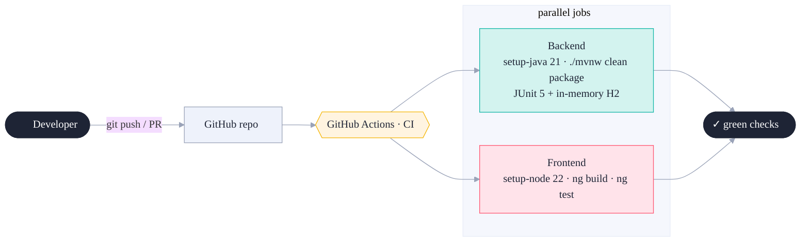
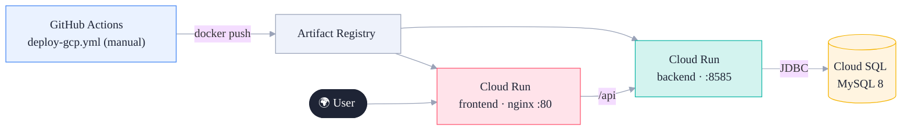
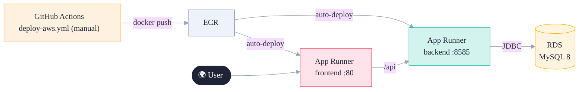
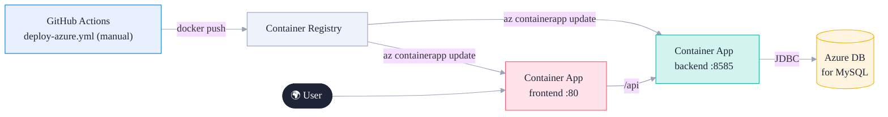

# Luv2Shop — CI/CD & Deployment

> **Local development stays primary.** `./run.sh` is how you build and run day to day.
> Everything below is **opt-in**: CI runs build+test on push, and the cloud deploys are
> **manual templates** (`workflow_dispatch`) you fill in with your own project IDs, registries,
> and secrets. Nothing here changes your local workflow.

- [Continuous Integration](#continuous-integration)
- [Container images](#container-images)
- [Cloud deployments](#cloud-deployments) — [GCP](#google-cloud-cloud-run) · [AWS](#aws-app-runner) · [Azure](#azure-container-apps)
- [What you configure](#what-you-configure)

---

## Continuous Integration

`.github/workflows/ci.yml` runs on every push / PR — pure verification, no deploys.

The backend job needs **no database** — tests run against in-memory H2. The frontend job runs
Vitest in jsdom (no browser needed).

---

## Container images

Both apps ship as containers (used by every cloud target):

| Image | Dockerfile | Base | Serves |
|---|---|---|---|
| Backend | `backend/Dockerfile` | `maven` → `eclipse-temurin:21-jre` | the Spring Boot jar on **:8585** |
| Frontend | `frontend/angular-ecommerce/Dockerfile` | `node` → `nginx:alpine` | the static SPA on **:80** |

> The frontend's API URL is baked in at build time. Pass it per environment:
> `docker build --build-arg API_URL=https://your-backend-host/api ...` (the deploy workflows do this
> from the `BACKEND_URL` repo variable).

---

## Cloud deployments

All three follow the same shape — **build images → push to the cloud's registry → roll out to a
serverless container service → talk to a managed MySQL.** Pick whichever cloud you like; they're
independent.

### Google Cloud (Cloud Run)
`.github/workflows/deploy-gcp.yml`

### AWS (App Runner)
`.github/workflows/deploy-aws.yml`

### Azure (Container Apps)
`.github/workflows/deploy-azure.yml`

---

## What you configure

Each deploy workflow has an `env:` block with `# <-- EDIT` markers, plus secrets/variables to add
under **repo Settings → Secrets and variables → Actions**.

| Cloud | Edit in the workflow | Secrets | Variables |
|---|---|---|---|
| **GCP** | `GCP_PROJECT`, `GCP_REGION`, `AR_REPO` | `GCP_SA_KEY`, `DB_URL`, `DB_USER`, `DB_PASS` | `BACKEND_URL` |
| **AWS** | `AWS_REGION` | `AWS_ACCESS_KEY_ID`, `AWS_SECRET_ACCESS_KEY`, `AWS_ACCOUNT_ID` | `BACKEND_URL` |
| **Azure** | `ACR_NAME`, `RESOURCE_GROUP` | `AZURE_CREDENTIALS` | `BACKEND_URL` |

**Common steps for any cloud:**
1. Create the registry + the two container services + a managed MySQL (`full-stack-ecommerce` db).
2. Set the backend's DB env vars (`SPRING_DATASOURCE_URL/USERNAME/PASSWORD`,
   `SPRING_DOCKER_COMPOSE_ENABLED=false`) on its service.
3. Provision the schema with [`backend/schema.sql`](../backend/schema.sql) (data self-seeds on first boot).
4. Deploy the **backend first**, copy its public URL into the `BACKEND_URL` repo variable, then deploy
   the frontend (so the SPA is built pointing at the live API).
5. (Optional) set `STRIPE_SECRET_KEY` and the Okta issuer env vars to light up payments / auth.

> **Chicken-and-egg note:** the frontend bakes in `BACKEND_URL` at build time, so the very first
> deploy is two passes (backend → set variable → frontend). After that, a single run does both.
