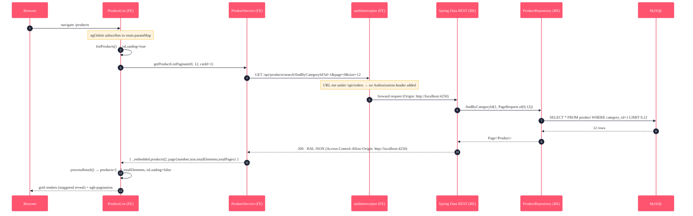
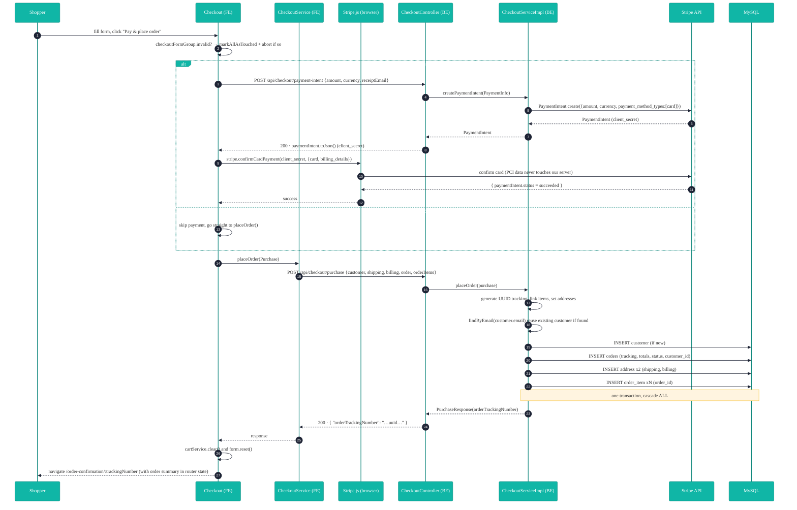
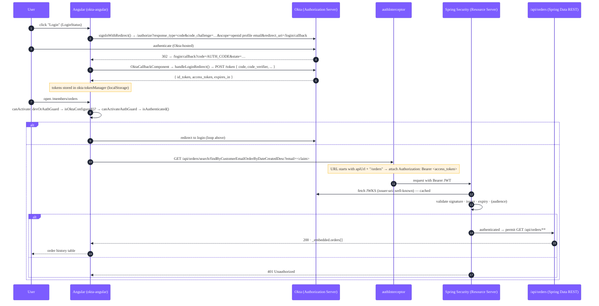

# Luv2Shop — Detailed Flows

The granular, **rebuild-from-this** reference. Every step lists the component, the exact HTTP call
(method, path, headers, body, status), the code that runs, and the database effect. If you read only
one doc to understand how the app *works*, read this one.

- [1. Catalog browse + pagination](#1-catalog-browse--pagination)
- [2. Checkout & payment (full)](#2-checkout--payment-full)
- [3. Authentication & authorization (Okta OIDC + JWT)](#3-authentication--authorization-okta-oidc--jwt)
- [4. Validation reference](#4-validation-reference)

Conventions: FE = Angular (`frontend/angular-ecommerce/src/app`), BE = Spring Boot
(`backend/.../ecommerceangularapp`). Base API path = `/api` on `http://localhost:8585`.

---

## 1. Catalog browse + pagination



**Response shape** (what `processResult` unwraps):
```jsonc
{ "_embedded": { "products": [ { "id":1, "name":"Java in Action", "unitPrice":14.99, ... } ] },
  "page": { "size":12, "totalElements":25, "totalPages":3, "number":0 } }
```

**Gotcha that bit us:** the grid contains `<ngb-pagination>`, which uses Angular's `$localize`.
Without the `@angular/localize/init` polyfill (in `angular.json`), rendering the grid throws
`ReferenceError: $localize is not defined` and Angular silently aborts the whole branch — products
*and* the empty-state vanish. The polyfill is mandatory.

---

## 2. Checkout & payment (full)

The end-to-end order placement, including the Stripe payment path and the cascade persistence.
Demo mode (no Stripe key) skips steps 3–6.



### Step-by-step (with exact contracts)

| # | Where | What happens |
|---|---|---|
| 1 | `Checkout.onSubmit()` (FE) | If `checkoutFormGroup.invalid` → `markAllAsTouched()` and **return**. Else clear `errorMessage`. |
| 2 | FE | If `stripeConfigured === false` → set `isSubmitting=true` and call `placeOrder()` (skip to step 9). |
| 3 | FE → BE | `POST /api/checkout/payment-intent` — body `PaymentInfo { amount:<cents>, currency:"USD", receiptEmail }`. `amount = Math.round(totalPrice*100)`. |
| 4 | `CheckoutController.createPaymentIntent` (BE) | Calls `checkoutService.createPaymentIntent(paymentInfo)`. |
| 5 | `CheckoutServiceImpl` (BE) | `Stripe.apiKey = stripe.key.secret`; `PaymentIntent.create({amount,currency,payment_method_types:["card"], receipt_email})`. Returns the PaymentIntent. Response = `paymentIntent.toJson()` (HTTP 200) containing **`client_secret`**. |
| 6 | `Checkout` + Stripe.js (FE) | `stripe.confirmCardPayment(client_secret, { payment_method: { card: cardElement, billing_details:{ email, name, address:{ line1, city, state, postal_code, country } } } }, { handleActions:false })`. Card data goes **browser → Stripe directly**. On `result.error` → show message, `isSubmitting=false`, **stop**. |
| 7 | FE | On success → `placeOrder()`. |
| 8 | `placeOrder()` (FE) | Build `Order(totalQuantity, totalPrice)`, map cart → `OrderItem[]`, assemble `Purchase { customer, shippingAddress, billingAddress, order, orderItems }`. Convert the selected country/state objects to their display-name strings on each address. |
| 9 | FE → BE | `POST /api/checkout/purchase` — `Content-Type: application/json`, body = the `Purchase` DTO (below). |
| 10 | `CheckoutController.placeOrder` (BE) | `@PostMapping("/purchase")` → `checkoutService.placeOrder(purchase)`. |
| 11 | `CheckoutServiceImpl.placeOrder` (BE, `@Transactional`) | (a) `orderTrackingNumber = UUID.randomUUID()`; (b) `orderItems.forEach(order::add)` (sets the bidirectional `order_id`); (c) `order.setShippingAddress/ setBillingAddress`; (d) `customerRepository.findByEmail(email)` → reuse if present, else new; (e) `customer.add(order)`; (f) `customerRepository.save(customer)`. |
| 12 | Hibernate → MySQL | Cascade `ALL` persists customer → order → order_items → 2 addresses in one transaction. |
| 13 | BE → FE | `200 · { "orderTrackingNumber": "<uuid>" }` (`PurchaseResponse`). |
| 14 | FE | `cartService.clear()` (empties cart + sessionStorage), `checkoutFormGroup.reset()`, `router.navigate(['/order-confirmation', trackingNumber], { state:{ summary } })`. |
| 15 | `OrderConfirmation` (FE) | Reads `history.state.summary`; shows tracking number + item lines + totals. |

### `POST /api/checkout/purchase` — exact request body
```jsonc
{
  "customer":        { "firstName":"Ada", "lastName":"Lovelace", "email":"ada@example.com" },
  "shippingAddress": { "street":"1 Test Ave", "city":"Testville", "state":"California",
                       "country":"United States", "zipCode":"90210" },
  "billingAddress":  { "street":"1 Test Ave", "city":"Testville", "state":"California",
                       "country":"United States", "zipCode":"90210" },
  "order":           { "totalQuantity":2, "totalPrice":21.98, "status":"Received" },
  "orderItems":      [ { "imageUrl":"…", "quantity":2, "unitPrice":10.99, "productId":1 } ]
}
```
Tables written: `customer`, `orders` (note: table is `orders`, the entity is `Order` — `order` is a SQL
keyword), `address` (×2, linked via `orders.shipping_address_id` / `billing_address_id`), `order_item`
(linked via `order_id`). See [`backend/schema.sql`](../backend/schema.sql).

---

## 3. Authentication & authorization (Okta OIDC + JWT)

Login uses **Okta** with **Authorization Code + PKCE**. The secured resource is the order-history
endpoint. *Active only when an Okta issuer is configured* — otherwise the app runs in demo mode and
every page is viewable.



### Front-end pieces
| Concern | Code |
|---|---|
| Okta config | `src/app/auth/okta-config.ts` (issuer, clientId, redirectUri, scopes, **pkce:true**) |
| Provider | `provideOktaAuth(withOktaConfig({ oktaAuth }))` in `app.config.ts` |
| Callback route | `{ path: 'login/callback', component: OktaCallbackComponent }` |
| Route guard | `devOrAuthGuard` (`auth/dev-auth.guard.ts`) — bypasses when Okta isn't configured, else delegates to `canActivateAuthGuard` |
| Token attach | `authInterceptor` (`interceptors/auth.interceptor.ts`) — adds `Authorization: Bearer` **only** for `/api/orders*` |
| Login UI | `LoginStatus` — `signInWithRedirect()` / `signOut()`, reads `authState$` |

### Back-end pieces
| Concern | Code |
|---|---|
| Resource server | `SecurityConfig.securedFilterChain` — `@ConditionalOnProperty(...jwt.issuer-uri)`; `oauth2ResourceServer().jwt()` |
| Open fallback | `SecurityConfig.openFilterChain` — `@ConditionalOnMissingBean(SecurityFilterChain.class)` (permit-all when no issuer) |
| Protected rule | `requestMatchers(GET, "/api/orders/**").authenticated()`, everything else `permitAll()` |
| Trust anchor | `spring.security.oauth2.resourceserver.jwt.issuer-uri` → Spring fetches the JWKS and validates tokens |

**Why two chains?** So the catalog/cart/checkout API stays open for local dev with no IdP, but the
moment you set `issuer-uri`, order history requires a valid bearer token — no code change.

---

## 4. Validation reference

Checkout reactive form (`Checkout.ngOnInit`), all groups:

| Field | Rules |
|---|---|
| firstName / lastName | required, minLength 2, not-only-whitespace |
| email | required, pattern `^[a-zA-Z0-9._%+-]+@[a-zA-Z0-9.-]+\.[a-zA-Z]{2,4}$` |
| street / city / zipCode | required, minLength 2, not-only-whitespace |
| country / state | required (object value; converted to name on submit) |

Custom validator: `Luv2ShopValidators.notOnlyWhitespace` (`validators/luv2shop-validators.ts`) — fails
when `value.trim().length === 0`. Backend trusts the DTO shape (Bean Validation can be layered on the
DTOs as a future hardening step).

See also: **[ARCHITECTURE.md](ARCHITECTURE.md)** (the high-level map) · **[API.md](API.md)** (endpoint reference).
